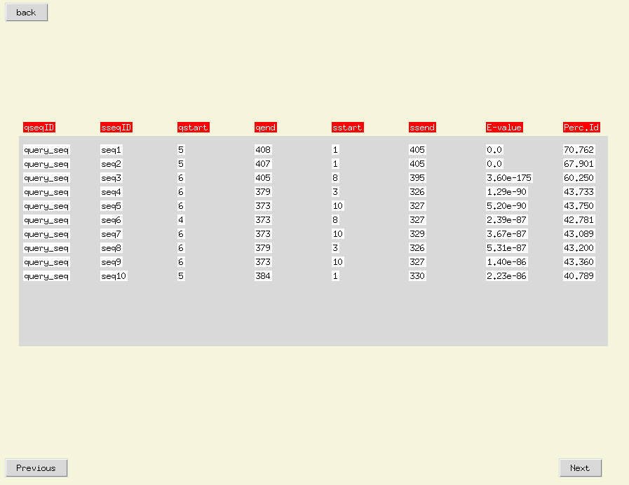

# Simple interface
A simple tkinter aplication that creates a database of a protein fasta file via makeblastdb and makes a query in it with blastp.

## Requirements
It just requires Tkinter and BLAST+, which can be installed with conda via:
```
conda install -c anaconda tk
conda install -c bioconda blast
```

## Usage
Execute main.py and introduce the corresponding fasta files, then click continue.


The output is the sequences in the database ordered by similarity to the query sequence.



For convenience display the results are divided in pages, each one showing 10 at a time. The pages can be navegated with the _Next_ and _Previous_ buttons.

The collumns shown mean the following:
- **qseqid:** Query sequence.
- **seqid:** Id of the sequence that alligned with the query.
- **qstart:** Start of the alligned region in the query.
- **qend:** End of the alligned region in the query.
- **sstart:** Start of the allinged region in the sequnce from the databse.
- **ssend:** End of the allinged region in the sequnce from the databse.
- **E-value:** E-value of the allignment.
- **Perc.Id.:** Percentage of identity between the sequences.

  ## References
“TkInter - Python Wiki.” Accessed July 8, 2023. https://wiki.python.org/moin/TkInter.

Camacho, Christiam, George Coulouris, Vahram Avagyan, Ning Ma, Jason Papadopoulos, Kevin Bealer, and Thomas L. Madden. “BLAST+: Architecture and Applications.” BMC Bioinformatics 10 (December 15, 2009): 421. https://doi.org/10.1186/1471-2105-10-421.

