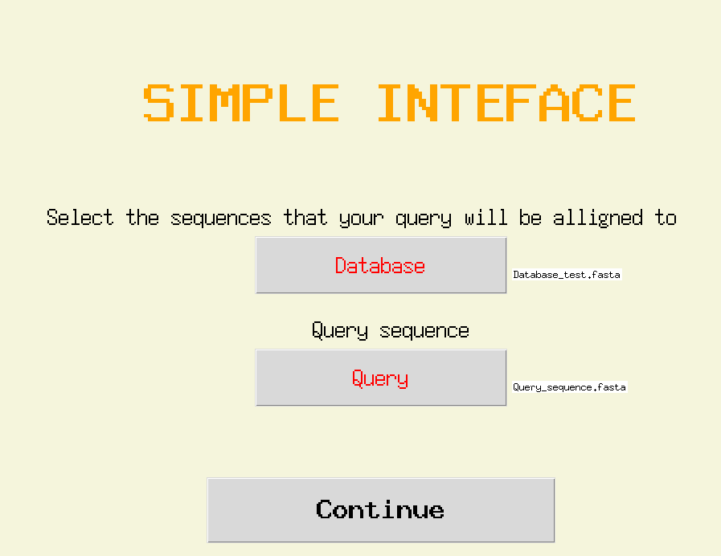

# Allign_blastp
A simple tkinter aplication that creates a database of a protein fasta file via makeblastdb and makes a query in it with blastp.

## Requirements
It just requires Tkinter and BLAST+, which can be installed with conda via:
```
conda install -c anaconda tk
conda install -c bioconda blast
```

## Usage
Execute main.py and introduce the corresponding fasta files, then click continue.



The output is the sequences in the database ordered by similarity to the query sequence. 
